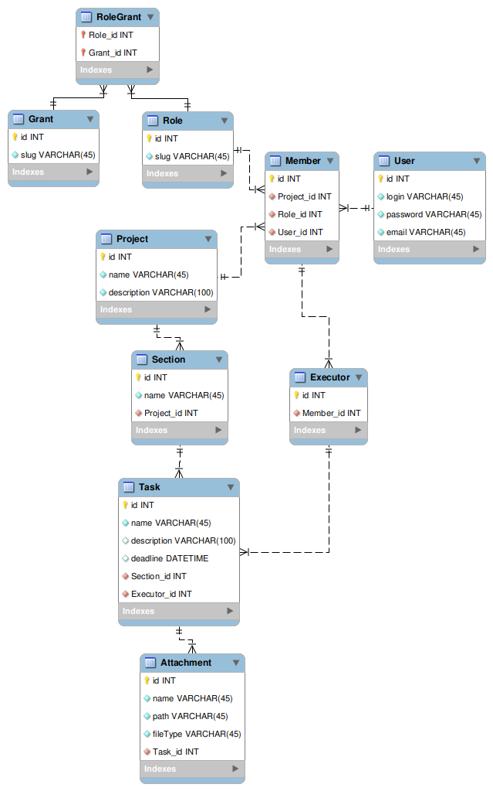

# Проєктування бази даних

## Модель бізнес-об'єктів

@startuml

    entity Project
    entity Project.name #ffffff
    entity Project.description #ffffff

    entity Section
    entity Section.name #ffffff

    entity Task
    entity Task.name #ffffff
    entity Task.description #ffffff
    entity Task.deadline #ffffff

    entity Attachment
    entity Attachment.name #ffffff
    entity Attachment.path #ffffff
    entity Attachment.fileType #ffffff

    entity Executor

    entity Member

    entity User
    entity User.login #ffffff
    entity User.password #ffffff
    entity User.email #ffffff

    entity Role
    entity Role.slug #ffffff

    entity Grant
    entity Grant.slug #ffffff

    Project.name --u-*  Project
    Project.description --u-*  Project
    Section "0,*" <--- "1,1" Project

    Role.slug --* Role

    Grant.slug --* Grant
    Role "0,*" --> "1,*" Grant

    Section.name --l-* Section

    Task "0,*" <--- "1,1" Section
    Task.name --* Task
    Task.description --* Task
    Task.deadline --* Task
    Task "1,1" <-- "0,*" Executor
    Executor "0,*" --> "1,1" Member 
    
    Attachment "0,*" <-- "1,1" Task
    Attachment.name --* Attachment
    Attachment.path --* Attachment
    Attachment.fileType --* Attachment

    Member "0,*" --> "1,1" User
    
    User.login --d-* User
    User.password --d-* User
    User.email --d-* User

    Member "0,*" ----> "1,1" Role
    Member "0,*" --> "1,1" Project

@enduml

## ER-модель

@startuml

namespace UserProfileManagement {
    entity User <<ENTITY>> {
        login: TEXT
        email: TEXT
        password: TEXT
    }
}

namespace ProjectManagement {
    entity Project <<ENTITY>> {
        name: TEXT
        description: TEXT
    }

    entity Section <<ENTITY>> {
        name: TEXT
        index: NUMBER
    }
    
    entity Task <<ENTITY>> {
        name: TEXT
        description: TEXT
        deadline: DATE
        index: NUMBER
    }
    
    entity Attachment <<ENTITY>> {
        name: TEXT
        path: TEXT
        fileType: TEXT
    }

    entity Executor <<ENTITY>> {

    }
}

namespace AccessPolicy {
    entity Member <<ENTITY>> { 
    }

    entity Role <<ENTITY>> {
        slug: TEXT
    }

    entity Grant <<ENTITY>> {
        slug: TEXT
    }
}

Member "0,*" ---> "1,1" Project
Member "0,*" --u-> "1,1" Role
Member "0,*" ---r-> "1,1" User

Task "1,1" <-u-- "0,*" Executor
Executor "0,*" --> "1,1" Member

Section "0,*" -u-> "1,1" Project
Section "1,1" <-- "0,*" Task
Task "1,1" <-- "0,*" Attachment

Role "0,*" --> "1,*" Grant

@enduml

## Опис ER-моделі:

### User (Користувач)

Використовується для зберігання даних облікового запису користувача, які вводяться під час його реєстрації, і з якими система звіряє введені під час авторизації дані.

Має поля:

- login: TEXT. Містить текст із логіном користувача;

- email: TEXT. Містить текст із адресою електронної пошти користувача;

- password: TEXT. Містить текст із паролем користувача.

   

### Member (Учасник)

Використовується як посередник; визначає те, які [права](#grant) певний [користувач](#user) має у доступі до певного [проєкту](#project).

Немає жодних полів.

Екземпляр учасника відповідає одному [проєкту](#project), одному [користувачу](#user) й одній [ролі](#role).

### Role (Роль)

Використовується для визначення прав [учасника](#member). 
Має поля:

- slug: TEXT. Містить унікальний рядок ідентифікатор.

Роль може мати від 1 до * [прав](#grant).

### Grant (Право)

Визначає єдине право використання проєкту.  
Має поля:

- slug: TEXT. Містить унікальний рядок ідентифікатор, зрозумілий людині, з описом права у форматі snake_case.

Початково у базу даних будуть занесені такі права:

*тут буде список у форматі "rule_name" - що право дозволяє робити*

### Project (Проєкт)

Використовується для роботи з проєктами.
Має поля:

- name: TEXT. Містить текст з назвою проєкту.
- description: TEXT. Містить текст з описом проєкту.

Проєкт може мати від 0 до * [розділів](#section) та від 0 до * [учасників](#member).
Користувачі можуть мати різні [ролі](#role) в проєкті, та виконувати різні дії відповідно до них. Коли [користувач](#user) створює проєкт, йому автоматично надається [роль](#role) "Замовник", що визначає максимальні [права](#grant).

### Section (Розділ)

Використовується для зручного сортування завдань.
має поля:
- name: TEXT. Містить текст з назвою розділу.
- index: NUMBER. Містить номер, що показує на якій позиції на сторінці розміщенна секція.  

Розділ може мати від 0 до * [завдань](#task).  
  
Особливим і обов'язковим є розділ **"Вільні завдання"**. У ньому знаходяться [завдання](#task), що не мають виконавців. Завдання видаляються з цього розділу, коли завдання набуває достатню кількість виконавців.  

### Task (Завдання)
використовується для роботи з завданнями.  
має поля:
+ name: TEXT. Містить текст з назвою завдання.  
+ description: TEXT. Містить текст з описом завдання.  
+ deadline: DATE. Містить дату, до якої завдання має бути виконано.  
+ index: NUMBER. Містить номер, що показує на якій позиції у Section (Розділі) завдання розміщенно.  

Завдання може мати від 0 до * [вкладень](#attachment).  
Якщо завдання знаходиться у [розділі "Вільні завдання"](#freeTasks), то відповідно не має виконавця (Executor). Щойно у Task з'являється щонайменше 1 виконавець (Executor), завдання видаляється з [розділу](#section) "Вільні завдання".  
Залежно від [ролі](#role) користувача у проєкті, користувач може виконувати різні дії з завданнями.

### Attachment (Вкладення)
використовується для вкладення до [завдання](#task) додаткових файлів різних типів (txt, png, mp4 і тд).  
має поля:
- name: TEXT. Містить текст з назвою вкладення.  
- path: TEXT. Містить шлях, за яким можна знайти вкладення.  
- fileType: TEXT. Містить розширенння вкладеного файлу.  

Щоб прикріпити вкладення до [завдання](#task), воно має бути завантаженим на сервер.  

## Реляційна схема

