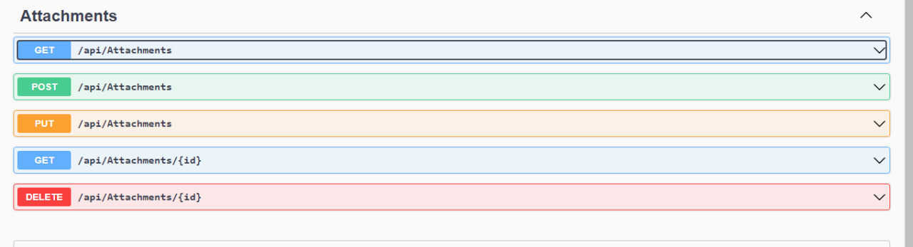
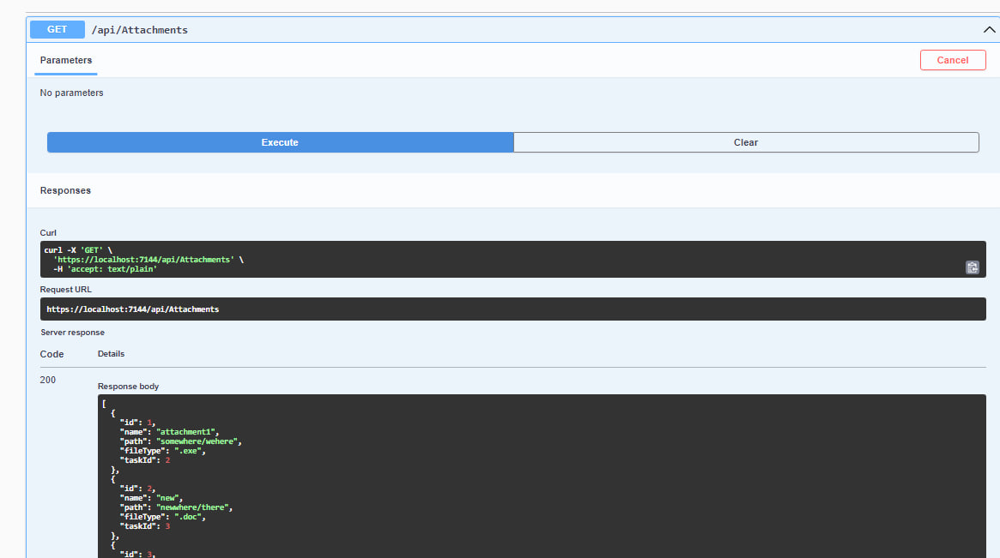
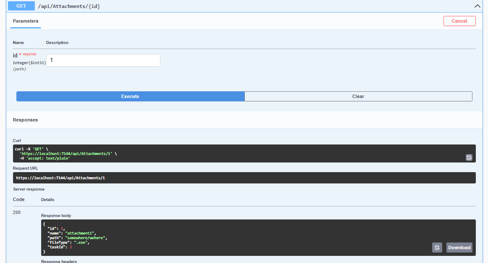
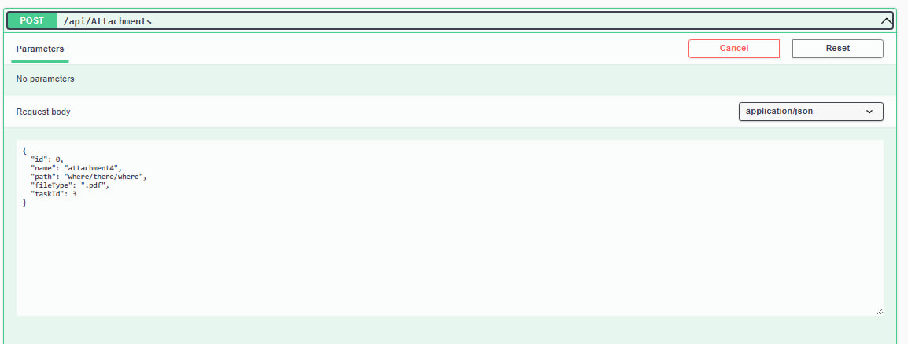
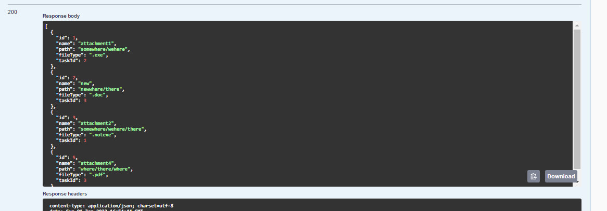
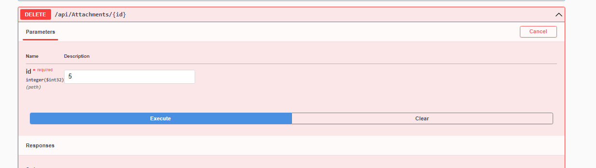
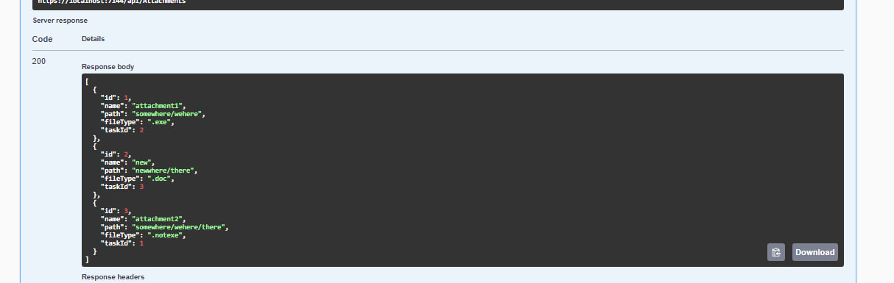
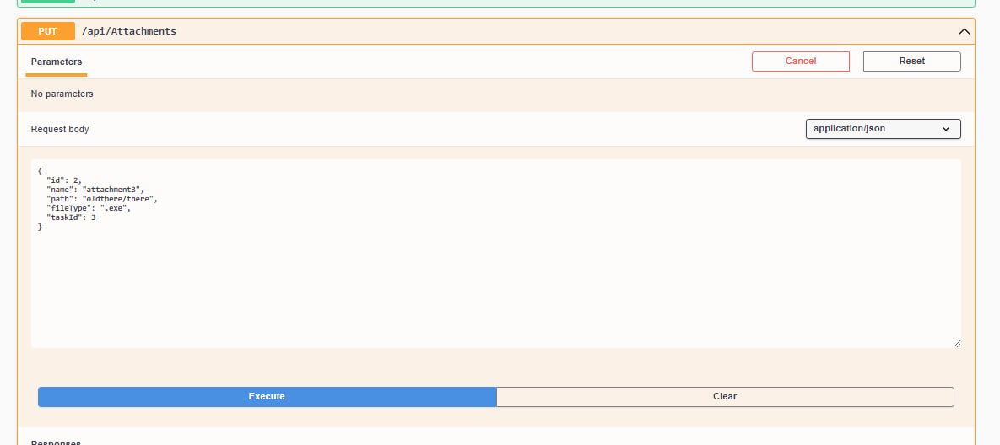
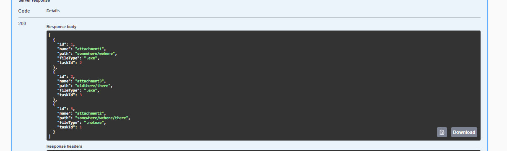

# Тестування працездатності системи

*В цьому розділі необхідно вказати засоби тестування, навести вихідні коди тестів та результати тестування.*

## Усі запити

## Запити Get

### Get All

### Get by id

## Запити Post

### Add

## Запити Delete

### Delete by id

## Запити Put

### Update

